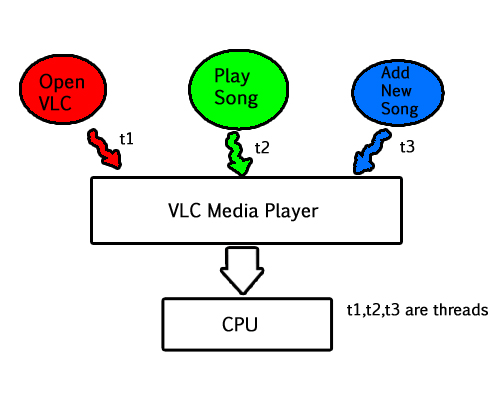

# What is Multi-threading?
Multi threading allow us to process multiple threads simultaneously.all threads occur in same process,it improve stability of our program,In multi threading each thread work independently,if we have error in our one thread then it would not effect on the rest of program.
## For example:
In vlc  media player we use three threads simultaneously one for open VLC
media player,second for play song and third for add new song.

#   What is Multi-tasking?
It allow us to perform more than one task at a time.
## For example 
In our daily life we often see that someone in the car,eating burger with taking his cell phone and driving at the same time, then we say he is multi tasking person.

# Difference between Multi-threading and Multi-tasking:

**1)** One of the basic difference is that multi tasking allow us to execute more then one task/program simultaneously , while in multi threading we execute multiple threads of the same or different process at same time.

**2)** In multi tasking different process shares a common resources, but in multi threading all threads work independently.

**3)**  In multi tasking different process/tasks do not share same memory,but in multi threading they do.

**4)** In multi tasking allocating different memory and resources become costly, whereas in multi threading they share the same resources which they belong it is cost effective solution.

**5)**  Multi-threading shares common memory if some thing in wrong on one thread then it effect on others.

**6)** Multi threading present difficulties in resolving error and synchronization issues occur in it

## Conclusion
 We can say that Multitasking is similar to Multi-programming whereas, Multi-threading is just thread-based multitasking. Multithreading is economical than multitasking, and we create threads much easily then create different process.

